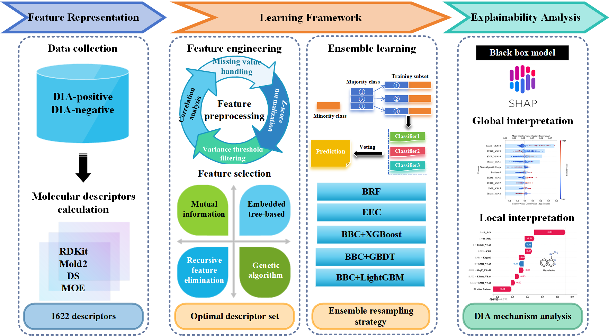

# InterDIA: Interpretable Prediction of Drug-induced Autoimmunity through Ensemble Machine Learning

## Overview
InterDIA is a comprehensive and interpretable machine learning framework for predicting drug-induced autoimmunity (DIA) toxicity. By integrating state-of-the-art ensemble learning approaches with multi-strategy feature selection, this framework provides accurate predictions while offering mechanistic insights through SHAP (SHapley Additive exPlanations) analysis.

## Key Features
- Advanced ensemble resampling techniques for handling imbalanced data
- Multi-strategy feature selection approaches
- Interpretable predictions through SHAP analysis
- Support for batch processing
- Free online prediction platform

## Dataset
The dataset comprises 597 drugs (148 DIA-positive and 449 DIA-negative):
- Training set: 477 drugs (118 positive, 359 negative)
- Test set: 120 drugs (30 positive, 90 negative)

## Installation

### Requirements
Python 3.9.19 is required for running this project. 

### Dependencies
Please check requirements.txt for detailed dependency information. Main packages include:

- Core Dependencies
  - numpy==1.23.5
  - pandas==2.2.3
  - scipy==1.11.2

- Machine Learning Libraries
  - scikit-learn==1.5.1
  - xgboost==1.6.1
  - lightgbm==3.3.5
  - imbalanced-learn==0.12.3
  - deap==1.4.1
  - hyperopt==0.2.7

- Visualization
  - matplotlib==3.9.2
  - seaborn==0.13.2
  - shap==0.46.0
  - plotly==5.24.1

## Code Structure
```
.
├── DataSet/
│   └── DIA_trainingset_RDKit_descriptors.csv   # Training set with RDKit descriptors 
│   └── DIA_testset_RDKit_descriptors.csv       # Test set with RDKit descriptors
│   └── DIA_trainingset_DS_descriptors.csv      # Training set with Discovery Studio descriptors
│   └── DIA_testset_DS_descriptors.csv          # Test set with Discovery Studio descriptors 
│   └── DIA_trainingset_MOE_descriptors.csv     # Training set with MOE descriptors
│   └── DIA_testset_MOE_descriptors.csv         # Test set with MOE descriptors
│   └── DIA_trainingset_Mold2_descriptors.csv   # Training set with Mold2 descriptors
│   └── DIA_testset_Mold2_descriptors.csv       # Test set with Mold2 descriptors
│   └── DIA-TrainingSet.sdf                     # Training set molecular structures
│   └── DIA-TestSet.sdf                         # Test set molecular structures  
├── notebooks/
│   └── DIA_RDKit_Prediction.ipynb                # Main analysis notebook using RDKit descriptors
├── streamlit/
│   ├── app.py                  # Main Streamlit application
│   └── requirements.txt        # Streamlit-specific dependencies
│   └── scaler_and_model.pkl    # Saved model and scaler
│   └── Xtrain_std.pkl          # Standardized training data
│   └── README.md
├── figures/
│   └── workflow.png                              # Research workflow diagram
├── shap_values_train.pkl                         # Pre-computed SHAP values for training set (477 compounds)
├── shap_values_test.pkl                          # Pre-computed SHAP values for test set (120 compounds)
├── requirements.txt
└── README.md
```

## Citations
If you use this code in your research, please cite:

```
Lina Huang, Peineng Liu, and Xiaojie Huang*. "InterDIA: Interpretable Prediction of Drug-induced Autoimmunity through Ensemble Machine Learning Approaches." Toxicology (2025): 154064.
```

## Contributing
We welcome contributions to this project. Please feel free to submit issues and pull requests.

## Contact
For questions and feedback, please contact:
- Xiaojie Huang - huangxj46@mail3.sysu.edu.cn

## Acknowledgments
This research was supported by the Medical Science and Technology Research Foundation of Guangdong Province (Grant Number: A2024082).
